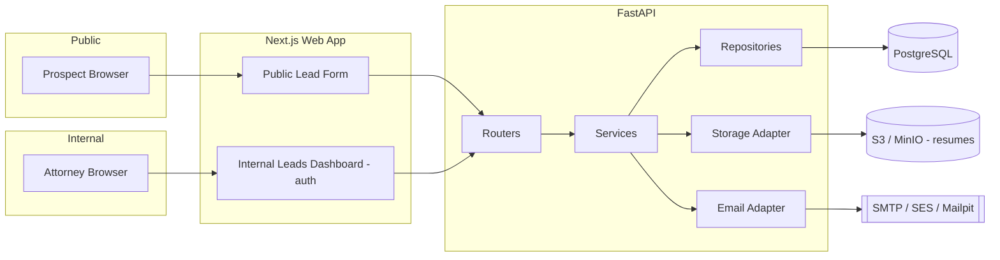
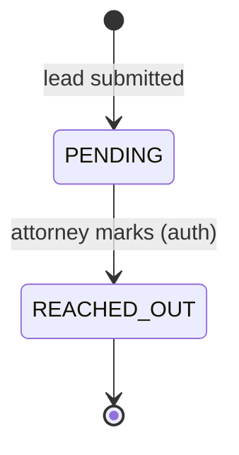

# Leads Tracker — System Design

> Implementation spec for a public lead-intake form + internal lead-management application.
> Stack: **FastAPI** (API) · **Next.js** (web) · **PostgreSQL** (data) · **S3/MinIO** (files) · **SMTP/SES** (email).
> Runs locally with a single `docker compose up`.
>
> This is the *what-to-build* reference. Rationale, alternatives considered, and future-evolution
> notes live in [design-choices.md](./design-choices.md).

---

## 1. Problem Statement

An application that supports **creating, getting, and updating leads**.

- A **lead** originates from a **public form** that prospects fill in. Required fields:
  - first name, last name, email, resume / CV (file upload).
- On submission, the system **emails both the prospect and an internal attorney**.
- An **internal, auth-guarded UI** lists all leads with their submitted data.
- Every lead has a **state**: it starts as `PENDING` and transitions to `REACHED_OUT`
  when an attorney manually marks it after reaching out.

---

## 2. Requirements

### 2.1 Functional

| # | Requirement |
|---|-------------|
| F1 | Public, unauthenticated endpoint/page to submit a lead (name, email, resume). |
| F2 | Persist the lead and store the uploaded resume durably. |
| F3 | On submit, send a confirmation email to the prospect **and** a notification email to the assigned attorney. |
| F4 | Authenticated internal UI listing all leads and their details. |
| F5 | Authenticated action to transition a lead `PENDING → REACHED_OUT`. |
| F6 | Retrieve a single lead (with a link/handle to download its resume). |

### 2.2 Non-Functional

| # | Requirement | Approach |
|---|-------------|----------|
| N1 | **One-command local setup** | `docker compose up` brings up web, API, DB, object store, mail catcher. |
| N2 | **Production-shaped structure** | Layered API (routers → services → repositories), typed models, migrations. |
| N3 | **Security** | Auth on all internal routes; validated + size-limited uploads; no secrets in code. |
| N4 | **Reliability of email** | Email sending decoupled from the request path; failures don't lose the lead. |
| N5 | **Portability** | Storage & email behind interfaces so local (MinIO/Mailpit) ↔ prod (S3/SES) swap cleanly. |
| N6 | **Observability** | Structured logs, health checks, request IDs. |

---

## 3. High-Level Architecture



**Request flow — lead submission (F1–F3):**

1. Prospect submits the public form (multipart: fields + resume file).
2. API validates input, streams the resume to object storage, writes the lead row (`state=PENDING`).
3. In the **same transaction**, the `AssignmentStrategy` picks an attorney and an active
   `lead_assignments` row is persisted (today: the single seeded attorney).
4. **Emails are only scheduled after steps 2–3 commit successfully.** If persisting the lead *or*
   creating the assignment fails, the transaction rolls back, **neither email is sent**, and the
   request ends with an error response to the public user (e.g. `500`) — we never notify anyone
   about a lead that wasn't durably stored and assigned.
5. On success, API schedules two emails as a **background task** — prospect confirmation + a
   notification to the already-assigned attorney (read from the committed assignment) — then returns
   `201` immediately.
6. Emails are dispatched via the email adapter (Mailpit locally, SES/SendGrid in prod).

**Request flow — mark reached out (F5):**

1. Attorney authenticates → internal dashboard.
2. Attorney clicks "Mark Reached Out" → `PATCH /leads/{id}/state`.
3. Service validates the transition (`PENDING → REACHED_OUT` only), persists, returns updated lead.

---

## 4. Data Model

### 4.1 `leads`

| Column | Type | Notes |
|--------|------|-------|
| `id` | UUID (PK) | Public identifier. |
| `first_name` | text | Required. |
| `last_name` | text | Required. |
| `email` | citext | Required, validated. |
| `resume_key` | text | Object-store key (not a public URL). |
| `resume_filename` | text | Original filename (sanitized). |
| `resume_content_type` | text | Validated MIME (pdf/doc/docx). |
| `state` | enum (`PENDING`,`REACHED_OUT`) | Defaults `PENDING`. |
| `created_at` | timestamptz | Server-set. |
| `updated_at` | timestamptz | Server-set on change. |

Indexes: `state` (dashboard filtering), `created_at` (sort), `email` (lookups).

### 4.2 State Machine



The transition is enforced in the service layer — a `REACHED_OUT → PENDING` or any illegal
transition returns `409 Conflict`.

### 4.3 `users` (internal auth)

Attorneys/admins for the internal UI: `id` (UUID), `email` (citext, unique), `hashed_password`,
`role`, `created_at`. Seeded via env/fixtures (no public signup) — **one attorney account** is
created on first boot.

### 4.4 `lead_assignments` (lead → attorney mapping)

| Column | Type | Notes |
|--------|------|-------|
| `id` | UUID (PK) | |
| `lead_id` | UUID (FK → `leads.id`) | Indexed. |
| `attorney_id` | UUID (FK → `users.id`) | Indexed. |
| `assigned_at` | timestamptz | Server-set. |
| `assigned_by` | text/enum | `SYSTEM` (auto-routing) vs. a user id (manual reassign). |
| `active` | boolean | Marks the current assignment; history rows kept as `false`. |

Invariant: **exactly one active assignment per lead**. Every submitted lead gets an active
`lead_assignments` row created in the same transaction as the lead.

**Assignment strategy — swappable interface:**

```
AssignmentStrategy.assign(lead) -> attorney_id
```

- **Current implementation:** `SingleAttorneyStrategy` returns the one seeded attorney → every lead
  routes to them.
- The interface is the extension point for real routing (round-robin, practice area, geography,
  load-based) with no change to the router, the `leads` table, or the submission flow.

The strategy is invoked in `leads_service` during submission, right after the lead is persisted and
before the notification email, so the attorney email targets the *assigned* attorney.

---

## 5. API Design

Base path `/api/v1`. JSON everywhere except the multipart upload.

| Method | Path | Auth | Purpose |
|--------|------|------|---------|
| `POST` | `/leads` | **public** | Submit a lead (multipart: fields + resume). → `201` |
| `GET` | `/leads` | required | List leads (pagination, `?state=` filter, sort, `?assigned_to_me=true`). |
| `GET` | `/leads/{id}` | required | Get one lead (includes its active assignee). |
| `GET` | `/leads/{id}/resume` | required | Download/streamed resume (or short-lived presigned URL). |
| `PATCH` | `/leads/{id}/state` | required | Transition state (`{ "state": "REACHED_OUT" }`). |
| `POST` | `/auth/login` | public | Obtain **JWT** for internal users. |
| `GET` | `/auth/me` | required | Current user (id, email, role) — drives the "assigned to me" toggle. |
| `GET` | `/healthz` | public | Liveness/readiness. |

**Filtering by assignee:** `GET /leads?assigned_to_me=true` restricts results to leads whose active
`lead_assignments` row points at the JWT's user; the attorney is derived from the token, never a
client-supplied value. Default (omitted/`false`) returns all leads. With one seeded attorney today
both return the same set.

**Validation:** Pydantic models for request/response; email format; upload constraints (allowlisted
MIME types, max size ~5–10 MB) enforced before touching storage.

**Errors:** consistent JSON error shape (`{ "detail": ... }`), correct status codes
(`400` validation, `401/403` auth, `404` missing, `409` illegal transition, `413` file too large).

---

## 6. Component Design

### 6.1 Backend (FastAPI) — layered

```
app/
├── main.py                # app factory, middleware, router wiring
├── api/v1/
│   ├── leads.py           # routers (HTTP only)
│   └── auth.py
├── services/              # business logic (state machine, orchestration)
│   ├── leads_service.py
│   ├── assignment/        # AssignmentStrategy interface + SingleAttorneyStrategy
│   └── email_service.py
├── repositories/          # DB access (SQLAlchemy)
│   ├── leads_repo.py
│   └── assignments_repo.py
├── adapters/              # swappable infra
│   ├── storage/           # S3 / MinIO / local
│   └── email/             # SMTP / SES / SendGrid / console
├── models/                # SQLAlchemy ORM models
├── schemas/               # Pydantic request/response
├── core/                  # config, security, logging, deps
└── migrations/            # Alembic
```

Routers stay thin (HTTP only); business rules live in services; infra is behind adapters so tests use
fakes and environments swap implementations via config.

### 6.2 Frontend (Next.js)

- **Public route** `/` — lead form (client-side + server-side validation), file input, success state.
- **Internal route** `/leads` — protected dashboard: table of leads, state badges, filters, an
  **"Assigned to me" toggle** (calls `GET /leads?assigned_to_me=true`, using the logged-in user's
  identity from `/auth/me`), "Mark Reached Out" action, resume download link.
- **Auth:** middleware guards internal routes; unauthenticated users are redirected to `/login`.
- App Router, server components for data fetch where possible, calling the FastAPI backend.

### 6.3 Auth

- Email + password login → **JWT** (short-lived access token, optional refresh). Passwords hashed
  with bcrypt/argon2. The token carries user id/email so services can resolve "the current attorney"
  (used by the assignee filter in §5).
- An auth dependency (`Depends`) protects every internal endpoint; the public `POST /leads` is exempt.

---

## 7. Persistent Storage

### 7.1 Relational data → PostgreSQL

- Structured, relational, transactional; `enum` for `state`, `citext` for email.
- SQLAlchemy + **Alembic** migrations for schema evolution.
- **Local:** Postgres container in Compose. **Prod:** managed (RDS / Cloud SQL / Neon / Supabase).

### 7.2 Files (resumes) → object storage

- Store resumes in **S3-compatible object storage**, keep only the **key** in Postgres.
- **Local:** **MinIO** container (S3 API compatible) — same S3 SDK code path locally and in prod.
- **Prod:** AWS S3 (or GCS/Azure Blob).
- **Access:** the bucket is never public. Serve resumes to authenticated attorneys by streaming
  through the API or via **short-lived presigned URLs**.

---

## 8. Email Service

Email is integrated behind an **`EmailAdapter` interface** (`send(to, template, context)`), so the
provider is a config choice.

| Environment | Implementation | Notes |
|-------------|----------------|-------|
| **Local dev** | **Mailpit** (or MailHog) — SMTP catcher with a web UI | Captures every outbound email so both messages are viewable without real sends. |
| **Production** | **AWS SES** or **SendGrid / Postmark / Resend** | Deliverability, DKIM/SPF, bounce handling, scale. |
| **Tests/CI** | Console/in-memory fake | Assert emails were "sent" without network. |

**Sending semantics (N4):** email is a **post-commit side effect**. The two emails are scheduled
**only after the lead and its assignment commit** (§3, step 4) — if either persistence step fails the
transaction rolls back, no email is sent, and the prospect gets an error. On success, FastAPI
`BackgroundTasks` dispatches the emails, decoupled from the HTTP response, so a slow/failing mail
provider never blocks submission or loses the stored lead.

**The two emails on submit (F3):**
1. **Prospect** → "We received your submission" confirmation.
2. **Attorney** → "New lead: {name}" notification, sent to the lead's **already-assigned** attorney
   (read from the persisted active `lead_assignments` row; email sending never re-runs the strategy),
   with a link into the dashboard.

Both rendered from templates so copy/branding changes don't touch code paths.

---

## 9. Local Development & Deployment

### 9.1 One command

```bash
docker compose up --build
```

Brings up, in one network:

| Service | Image / build | Purpose | Port (example) |
|---------|---------------|---------|------|
| `web` | Next.js (Node) | Frontend | 3000 |
| `api` | FastAPI (uvicorn) | Backend API | 8000 |
| `db` | postgres | Persistent data | 5432 |
| `minio` | minio/minio | Resume object storage | 9000/9001 |
| `mailpit` | axllent/mailpit | Email catcher + UI | 8025 (UI) |

- **Config via env** (`.env` + `.env.example`): DB URL, S3/MinIO creds+bucket, SMTP host, JWT secret,
  attorney notification address.
- **Migrations** run on API startup (or a one-shot init container) via Alembic.
- **Seed** a demo attorney user and the MinIO bucket on first boot.
- Healthchecks + `depends_on` so the API waits for Postgres/MinIO to be ready.

### 9.2 Access after boot

- Public form & internal UI → `http://localhost:3000`
- API docs (OpenAPI/Swagger) → `http://localhost:8000/docs`
- Captured emails (Mailpit) → `http://localhost:8025`
- MinIO console → `http://localhost:9001`

---

## 10. Security Considerations

- **AuthN/AuthZ:** every internal endpoint behind an auth dependency; least-privilege roles.
- **Uploads:** MIME allowlist (pdf/doc/docx), size cap, filename sanitization, store under random
  keys; never trust client-supplied paths. Optionally AV-scan in production.
- **Resume access:** private bucket + streamed/presigned access only for authenticated users.
- **Secrets:** only via env / secrets manager; `.env` git-ignored; `.env.example` documents shape.
- **Transport:** HTTPS/TLS in production; secure, HTTP-only cookies if cookie-based sessions.
- **Input validation:** Pydantic on every request; parameterized queries via ORM (no SQL injection).
- **Rate limiting / abuse:** the public `POST /leads` is a spam surface — add rate limiting and
  optionally CAPTCHA in production.
- **CORS:** restrict to the known web origin.

---

## 11. Assumptions

- **Attorney routing:** one seeded attorney receives every lead today, via `SingleAttorneyStrategy`
  behind the `AssignmentStrategy` interface and the `lead_assignments` table.
- **Auth model:** JWT with email + password login; token identity also powers the "assigned to me"
  filter.
- **Resume file types:** PDF/DOC/DOCX (adjust the allowlist as needed).
- **No public prospect accounts:** the form is anonymous; only internal users authenticate.
- **Single attorney notification address** for the assignment (the assigned attorney's email).
